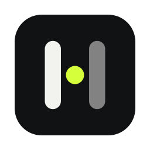
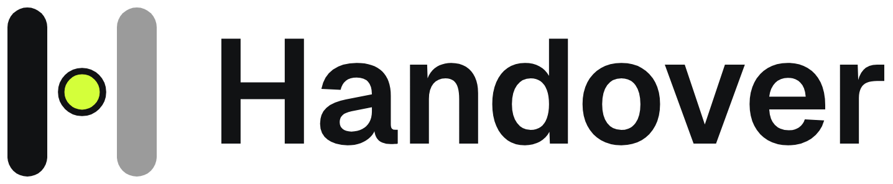

# Handover brand kit

<p>
  
  &nbsp;
  
</p>

## The mark

**The pass.** An H made of two stems, with the crossbar replaced by a ball
mid-pass: the thing you saw, travelling from you to the agent. It is strictly
monochrome: black on white, or white on black, never a colour.

Everything here is generated from one geometry by `scripts/build.mjs`. Change
the mark there, not in the exported files.

| File | Use it for |
|---|---|
| `logo/handover-app-icon.svg` · `png/handover-app-icon-*.png` | The app icon (macOS grid: 824px tile inset 100px on 1024). Source for `tauri icon`. |
| `logo/handover-tile.svg` · `png/handover-tile-*.png` | Full-bleed white tile with a hairline rim: avatars and favicons. |
| `logo/handover-tile-dark.svg` · `png/handover-tile-dark-*.png` | The reverse tile, for dark surfaces. |
| `logo/handover-glyph-on-light.svg` | The glyph alone on white or any light surface. |
| `logo/handover-glyph-on-dark.svg` | The glyph alone on black or any dark surface. |
| `logo/handover-glyph-mono.svg` | Pure black, for print and anything that recolours it. |
| `logo/handover-tray-template.svg` · `png/tray/` | macOS menu-bar template (black + alpha; macOS tints it). Copied into `apps/desktop/src-tauri/icons/`. |
| `logo/handover-lockup-*.svg` · `png/handover-lockup-*.png` | Glyph + wordmark, horizontal or stacked, for dark or light backgrounds. |
| `favicon/` | `favicon.svg` plus 16–512px PNGs (180 is the Apple touch icon). |

**Clear space:** keep at least the ball's diameter × 2 empty around the glyph,
and one stem width around a lockup.
**Minimum size:** glyph 16px tall on screen; lockup 20px tall.

Don't:
- add colour to any part of the mark, including the ball;
- set the mark in grey or at reduced opacity (use black or white only);
- rotate, outline, add shadows or gradients, or stretch the mark;
- set "Handover" in another typeface next to the mark (use the lockup files).

## Colour

Handover is monochrome. Emphasis comes from weight, size and contrast, never
from an accent colour.

| | Hex | Role |
|---|---|---|
| Ink | `#111111` | Text, the mark, primary buttons. |
| Ink soft | `#3a3a3a` | Body text where full ink is too heavy. |
| Muted | `#6f6f6f` | Secondary text and captions. |
| Faint | `#9a9a9a` | De-emphasised headline phrases, placeholders. Large text only. |
| Line | `#e3e3df` | Hairlines, tile rims. |
| Line strong | `#d3d3ce` | Input borders, keycaps. |
| Soft | `#f6f6f4` | Panels on white. |
| White | `#ffffff` | The page and the app icon tile. |
| Night | `#0e0e0f` · raised `#1a1a1b` · snow `#f5f5f5` | The same roles, reversed, for dark mode. |

Contrast on white: ink 18.9:1, ink soft 11.4:1, muted 5.0:1 (all pass WCAG AA
for body text); faint 2.8:1, so keep it to large headline text.

**Status colours are not brand colours.** The app's green (running), red
(idle) and amber (provider unreachable) lights carry meaning and stay as they
are. Never use them decoratively.

## Type

**Geist** (SemiBold 600 for headlines and the wordmark, Medium 500 for body)
and **Geist Mono** (keycaps, code, labels). Both are in `fonts/` under the SIL
Open Font License (`fonts/OFL.txt`), and are also on Google Fonts. Headlines run
tight (letter-spacing about −2.5%); keycaps always use Geist Mono.

## Motion

The brand's one motion idea is **the pass**: the ball travels along a dotted
line from left to right and lands. Use it for handoff moments (a send,
a page transition), never as idle decoration.

## Social

| File | Size | Where |
|---|---|---|
| `social/x-avatar.png` | 400×400 | X profile picture (glyph centred for the circular crop). |
| `social/x-header.png` | 1500×500 | X header. Content sits right of centre, clear of the avatar. |
| `social/github-social-preview.png` | 1280×640 | GitHub → Settings → Social preview. Shown when the repo link is shared. |
| `social/og-image.png` | 1200×630 | Website `og:image` / `twitter:image`. |
| `social/post-update-example.png` | 1600×900 | Announcement post. Edit the `post({ … })` call in `scripts/build.mjs` and rebuild. |

## Rebuilding

```bash
cd brand/scripts
npm install
node build.mjs
```

The build needs Chromium to render PNGs. It finds Playwright's cached headless
shell automatically (`npx playwright install chromium-headless-shell`), or set
`CHROME=/path/to/chrome`. It also refreshes the app's tray icons. To regenerate the app icon set after changing the mark:

```bash
cd apps/desktop/src-tauri
../ui/node_modules/.bin/tauri icon ../../../brand/png/handover-app-icon-1024.png
```
